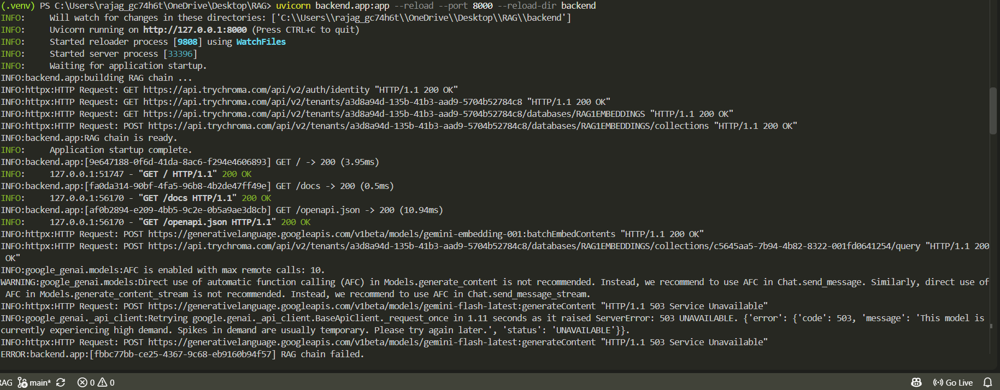
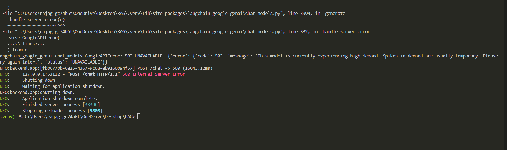
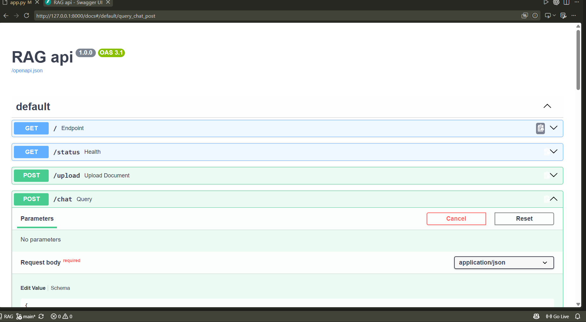
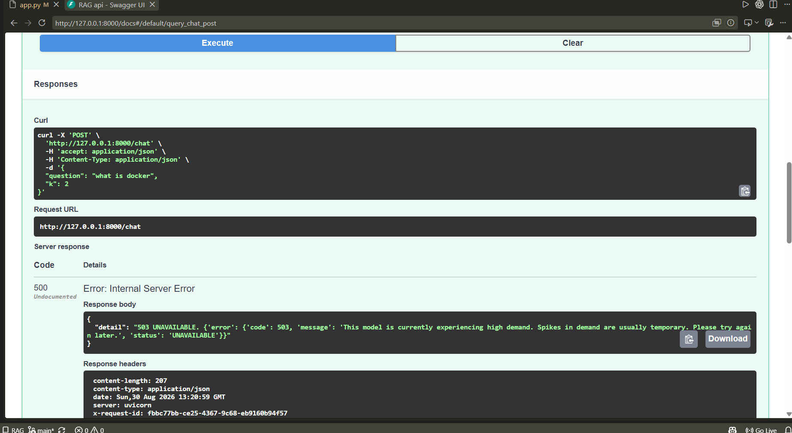

# RAG with LangChain

A retrieval-augmented generation pipeline built with LangChain, Chroma Cloud, and
Google's Gemini models — with evaluation and observability built in rather than
bolted on afterward.

Every stage of the pipeline (ingestion, retrieval, generation, and the API layer
in front of it) writes structured JSONL traces, so you can debug a bad answer or
a slow request by looking at exactly which stage caused it instead of guessing.

## Features

- **Ingestion** — load PDFs/text files, chunk them, embed with Gemini, and store in Chroma
- **Query chain** — retrieval + generation via LangChain's `create_retrieval_chain`, with retrieval and generation latency measured separately
- **REST API** — FastAPI service exposing `/upload` and `/chat`, with per-request tracing and rate limiting
- **Retrieval evaluation** — recall@k / precision@k / MRR against a labeled query set, to catch chunking or embedding regressions before they reach production
- **Observability** — every stage (load, chunk, embed/store, retrieve, generate, API request) logs timing, counts, and errors to its own JSONL trace file

## Architecture

```
                    ┌─────────────┐
   PDFs / .txt ───▶ │  ingest.py  │───▶ Chroma Cloud (vector store)
                    └─────────────┘           ▲
                          │                    │
                    ingest_traces.jsonl        │
                                                │
                    ┌─────────────┐            │
   question ───────▶│   rag.py    │◀───────────┘
                    │ (retrieve + │───▶ Gemini (gemini-flash-latest)
                    │  generate)  │
                    └─────────────┘
                          │
                    query_traces.jsonl

                    ┌─────────────┐
   HTTP request ───▶│   app.py    │──▶ wraps ingest.py + rag.py behind
                    │  (FastAPI)  │    /upload and /chat
                    └─────────────┘
                          │
        api_traces.jsonl, upload_traces.jsonl, chat_traces.jsonl
```

## Project structure

```
.
├── backend/
│   ├── app.py              # FastAPI service (/upload, /chat, /status)
│   ├── ingest.py            # CLI + importable ingestion pipeline
│   └── rag.py                # CLI + importable retrieval/generation chain
├── eval_retrieval.py         # offline retrieval evaluation (recall@k, precision@k, MRR)
├── sample_eval_set.json      # template for labeled eval queries
├── uploaded_docs/            # scratch dir for files received via /upload (gitignored)
├── .env                       # local secrets, not committed
├── .env.example                # template showing required variables
├── .gitignore
├── LICENSE
└── README.md
```

## Prerequisites

- Python 3.11+
- A [Chroma Cloud](https://www.trychroma.com/) account (tenant, database, API key)
- A Google AI Studio API key with access to Gemini embedding and chat models

## Setup

```bash
python -m venv .venv
# Windows (PowerShell)
Set-ExecutionPolicy -Scope Process -ExecutionPolicy RemoteSigned
.venv\Scripts\Activate.ps1
# macOS / Linux
source .venv/bin/activate

pip install -r requirements.txt
cp .env.example .env   # then fill in the values below
```

### Environment variables

| Variable | Required | Description |
|---|---|---|
| `GOOGLE_API_KEY` | yes | Google AI Studio key, used for both embeddings and chat generation |
| `CHROMA_API_KEY` | yes | Chroma Cloud API key |
| `CHROMA_TENANT` | yes | Chroma Cloud tenant ID |
| `CHROMA_DATABASE` | yes | Chroma Cloud database name |
| `CHROMA_COLLECTION` | no | Collection name (default: `my_docs`) |
| `INGEST_LOG_PATH` | no | Ingestion trace file (default: `ingest_traces.jsonl`) |
| `QUERY_LOG_PATH` | no | CLI query trace file (default: `query_traces.jsonl`) |
| `API_TRACE_LOG` | no | Per-request API trace file (default: `api_traces.jsonl`) |
| `CHAT_TRACE_LOG` | no | `/chat` trace file (default: `chat_traces.jsonl`) |
| `UPLOAD_TRACE_LOG` | no | `/upload` trace file (default: `upload_traces.jsonl`) |

## Usage

### Ingest documents (CLI)

```bash
python backend/ingest.py --path ./docs --chunk-size 800 --overlap 150
```

Accepts a single `.pdf`/`.txt` file or a directory (recurses through it, loading
all PDFs and text files it finds). Prints a summary and appends a full trace —
document/chunk counts, chunk-size stats, per-stage latency, and any per-file
errors — to `ingest_traces.jsonl`.

### Query from the command line

```bash
# single question
python backend/rag.py --query "How does chunking affect retrieval quality?"

# interactive mode
python backend/rag.py
```

Each query logs its answer, retrieved sources (file + page + snippet), a
groundedness score, and retrieval/generation latency split out separately to
`query_traces.jsonl`.

### Run the API

```bash
uvicorn backend.app:app --reload --port 8000 --reload-dir backend
```

| Endpoint | Method | Description | Rate limit |
|---|---|---|---|
| `/` | GET | Health check / welcome message | — |
| `/status` | GET | Whether the RAG chain initialized successfully | — |
| `/upload` | POST | Upload a `.pdf`/`.txt`, ingest it into the collection | 5/minute |
| `/chat` | POST | Ask a question, get an answer + source chunks | 10/minute |

Every response includes an `X-Request-ID` header, which correlates that request
across `api_traces.jsonl` and the endpoint-specific trace file (`upload_traces.jsonl`
or `chat_traces.jsonl`) — useful for tracking down a specific slow or failed request.

### Evaluate retrieval quality

```bash
python eval_retrieval.py --eval-set sample_eval_set.json --k 4
```

Runs a labeled set of queries against the live collection and reports
recall@k, precision@k, and MRR. Run this after any change to chunking
parameters, the embedding model, or the source documents, and compare
against the previous run in `eval_traces.jsonl` to catch regressions.

## Observability

Every trace file is newline-delimited JSON (one record per event), so it's
easy to `tail -f`, grep, or load into a notebook/BI tool. At a glance:

- **`ingest_traces.jsonl`** — per-run: stage latencies (load/chunk/store), document and chunk counts, chunk-size distribution, per-file errors
- **`query_traces.jsonl`** / **`chat_traces.jsonl`** — per-question: retrieved sources, groundedness score, retrieval vs. generation latency split
- **`api_traces.jsonl`** — per-request: request ID, path, status code, total latency
- **`upload_traces.jsonl`** — per-upload: save/load/chunk/store timing, success/failure

Because retrieval and generation latency are measured separately (via a
LangChain callback hooked into `on_retriever_start/end` and
`on_chat_model_start`/`on_llm_end`), a slow or failed `/chat` request can be
diagnosed immediately from its trace — e.g. a normal `retrieval_ms` with a
30-second `generation_ms` points at the LLM provider, not your retrieval
pipeline or Chroma.

## Known limitations

- Groundedness is scored with a lexical-overlap heuristic, not an LLM-judge or
  NLI model — treat it as a rough signal, not a precise faithfulness metric
- No automatic retry/backoff tuning beyond LangChain's defaults if the Gemini
  API returns `503` under load — requests will hang for the duration of the
  client's retry policy before failing
- `/upload` ingests into the shared collection with no per-user namespacing;
  anyone with API access can query documents anyone else uploaded

## License

See [LICENSE](./LICENSE).

# working proof:
## terminal



## fastapi dashboard:


